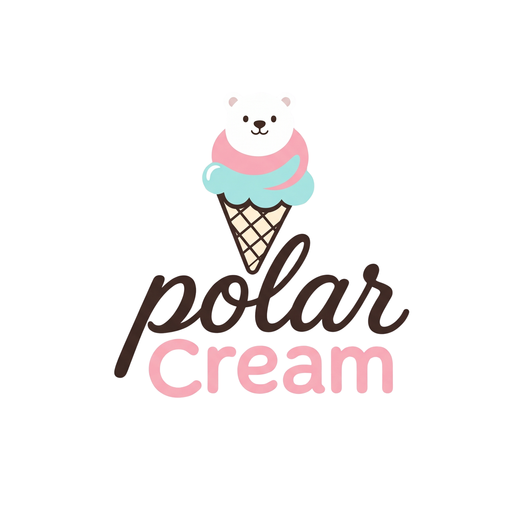
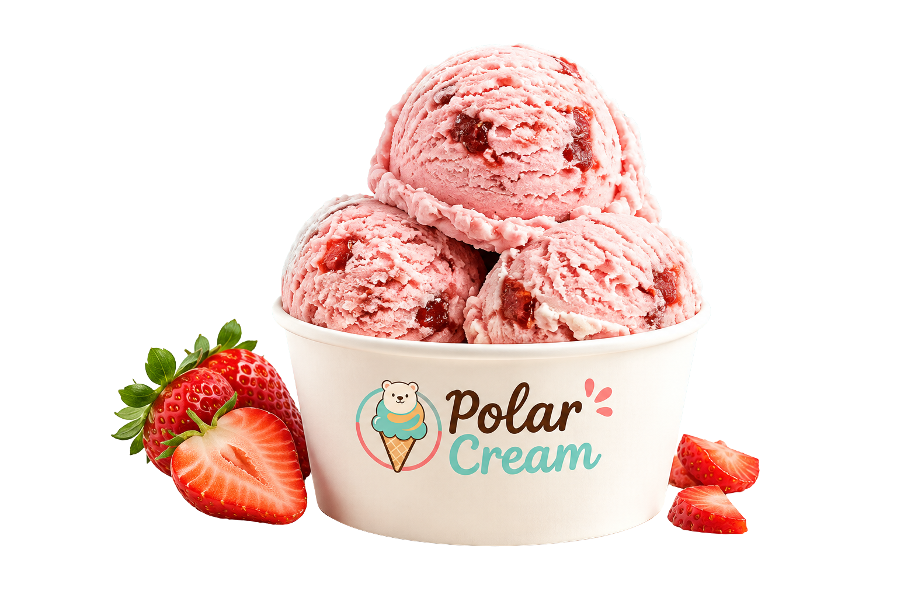
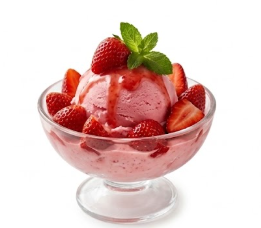
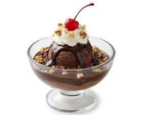
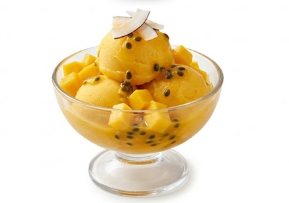
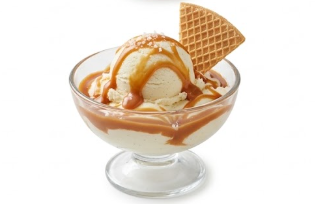

[index.html](https://github.com/user-attachments/files/32367678/index.html)
<!DOCTYPE html>
<html lang="es">
<head>
<meta charset="UTF-8">
<meta name="viewport" content="width=device-width, initial-scale=1.0">
<title>Polar Cream | Heladería Premium</title>
<link rel="icon" href="PolarCreamLogo.png">
<link rel="preconnect" href="https://fonts.googleapis.com">
<link rel="preconnect" href="https://fonts.gstatic.com" crossorigin>
<link href="https://fonts.googleapis.com/css2?family=Anton&family=Nunito:wght@400;600;700;800;900&family=Pacifico&display=swap" rel="stylesheet">
<link rel="stylesheet" href="style.css">
</head>
<body>

<header class="navbar" id="navbar">
  
  
  <!-- Truco 100% CSS para el menú móvil sin usar JavaScript -->
  <input type="checkbox" id="menu-toggle" class="menu-toggle">
  <label for="menu-toggle" class="mobile-menu-btn" aria-label="Abrir menú de navegación">☰</label>

  <nav>
    <ul class="nav-links" id="navLinks">
      <li><a href="#inicio">Inicio</a></li>
      <li><a href="#historia">Historia</a></li>
      <li><a href="#menu">Menú</a></li>
      <li><a href="#promociones">Promociones</a></li>
      <li><a href="#contacto">Contacto</a></li>
    </ul>
  </nav>
</header>

<section id="inicio" class="hero">
  

    100% Artesanal
    <h1>Descubre elSabor del Polo</h1>
    
Disfruta de nuestros sabores tradicionales con la calidad y alegría de siempre. Una experiencia refrescante en cada bocado.

    <a href="#menu" class="btn-primary">Ver Sabores</a>
  

  

    

      
    

  

</section>

<section id="historia" class="page-section about">
  

    <h2>Nuestra Historia</h2>
    
<strong>Nacimos con una idea sencilla, pero llena de significado: transformar un momento cotidiano en una experiencia memorable.</strong> Desde nuestros primeros días, nos hemos dedicado a crear helados artesanales que combinan la riqueza de los sabores tradicionales con una visión fresca, moderna y sofisticada.

    
Inspirados por la <strong>frescura del polo y la esencia vibrante del Caribe</strong>, seleccionamos cuidadosamente cada ingrediente para crear una experiencia que se distingue por su sabor, textura y calidad. Cada preparación es elaborada con dedicación y atención a los detalles, porque creemos que la verdadera excelencia se encuentra en aquello que se hace con pasión.

    
Nuestra identidad nace de la unión entre <strong>tradición e innovación</strong>. Respetamos los sabores que forman parte de nuestra historia, mientras exploramos nuevas combinaciones que despiertan los sentidos y convierten cada visita en una oportunidad para descubrir algo diferente.

    
Para nosotros, un helado es mucho más que un postre. Es una pausa para disfrutar, una celebración de los pequeños momentos y una manera de compartir emociones con quienes más queremos. Por eso, cada bola representa nuestro compromiso con la <strong>calidad premium, la creatividad y la satisfacción de nuestros clientes</strong>.

    
Hoy continuamos creciendo con la misma pasión que nos vio comenzar, llevando en cada sabor nuestra esencia y nuestro deseo de crear momentos únicos. <strong>Porque cuando la calidad se encuentra con la pasión, cada helado se convierte en una experiencia que merece ser recordada.</strong>

  

</section>

<section id="menu" class="page-section menu">
  

    LO MÁS FRESCO
    <h2>Nuestro Menú</h2>
    
Los favoritos de la casa, elaborados con los mejores ingredientes.

  

  

    <article class="menu-card">
      

      

        
<h3>Fresa Caribeña</h3><strong>RD$ 120</strong>

        
Helado cremoso de fresas frescas seleccionadas.

        
ARTESANAL<i>♥</i>

      

    </article>

    <article class="menu-card">
      

      

        
<h3>Doble Chocolate</h3><strong>RD$ 135</strong>

        
Intenso, cremoso y perfecto para los amantes del chocolate.

        
ARTESANAL<i>♥</i>

      

    </article>

    <article class="menu-card">
      

      

        
<h3>Mango Tropical</h3><strong>RD$ 110</strong>

        
Un sabor tropical elaborado con mango fresco y natural.

        
ARTESANAL<i>♥</i>

      

    </article>

    <article class="menu-card">
      

      

        
<h3>Coco Loco</h3><strong>RD$ 125</strong>

        
Suave, tropical y cremoso con auténtico sabor a coco.

        
ARTESANAL<i>♥</i>

      

    </article>
  

</section>

<section id="promociones" class="page-section promos">
  

    <h2>¡Oferta de Verano!</h2>
    
Lleva 3 bolas de helado por el precio de 2. ¡Combina tus sabores favoritos y refréscate al máximo!

    <button>Aprovechar Oferta</button>
  

</section>

<footer id="contacto" class="footer">
  

    

      
      
Helados artesanales hechos con pasión y sabor caribeño.

    

    

      <h3>Contacto</h3>
      
Calle Principal #45, La Vega, RD.

      
(809) 555-0000

      
correo@polarcream.com

    

    

      <h3>Síguenos</h3>
      <a href="#">Instagram</a>
      <a href="#">Facebook</a>
      <a href="#">TikTok</a>
    

  

  
© 2026 Polar Cream. Todos los derechos reservados.

</footer>

</body>
</html>:root {
    --pink: #e98da4;
    --pink-dark: #d87590;
    --aqua: #55c8c0;
    --cream: #fff0cf;
    --cream-dark: #f4d6a8;
    --choco: #3b2925;
    --text: #654c44;
    --white: #fff;
}

html {
    scroll-padding-top: 80px;
}

* {
    margin: 0;
    padding: 0;
    box-sizing: border-box;
    scroll-behavior: smooth;
}

body {
    font-family: 'Nunito', sans-serif;
    background: var(--cream);
    color: var(--choco);
    overflow-x: hidden;
    padding-top: 80px;
}

.navbar {
    height: 80px;
    display: flex;
    align-items: center;
    justify-content: space-between;
    padding: 10px 5%;
    background: var(--choco);
    position: fixed;
    inset: 0 0 auto;
    z-index: 1000;
    border-bottom: 5px solid var(--cream);
    transition: 0.3s;
}

.logo {
    position: relative;
}

.logo img {
    width: 90px;
    height: 90px;
    object-fit: cover;
    border-radius: 50%;
    background: #fff;
    border: 4px solid var(--pink);
    position: absolute;
    top: -30px;
    box-shadow: 0 8px 18px rgba(59, 41, 37, 0.3);
}

.nav-links {
    list-style: none;
    display: flex;
    gap: 30px;
    align-items: center;
    margin-left: auto;
}

.nav-links a {
    color: var(--cream);
    text-decoration: none;
    font-weight: 900;
    text-transform: uppercase;
    letter-spacing: 0.5px;
    transition: 0.25s;
}

.nav-links a:hover {
    color: var(--pink);
}

/* Ocultar el checkbox que controla el menú */
.menu-toggle {
    display: none;
}

.mobile-menu-btn {
    display: none;
    background: none;
    border: 0;
    color: var(--cream);
    font-size: 2rem;
    cursor: pointer;
    user-select: none;
}

.hero {
    min-height: calc(100vh - 80px);
    display: flex;
    align-items: center;
    justify-content: space-between;
    gap: 40px;
    padding: 65px 8%;
    background: var(--cream);
    position: relative;
    overflow: hidden;
}

.hero::after {
    content: "";
    position: absolute;
    width: 34%;
    height: 100%;
    right: 0;
    top: 0;
    background: var(--pink);
    clip-path: polygon(25% 0, 100% 0, 100% 100%, 0 100%);
    z-index: 0;
}

.hero-content {
    max-width: 55%;
    position: relative;
    z-index: 2;
}

.badge {
    display: inline-block;
    padding: 8px 18px;
    background: var(--choco);
    color: var(--cream); 
    border: 2px solid var(--cream);
    border-radius: 30px;
    font-weight: 900;
    text-transform: uppercase;
    letter-spacing: 1px;
    margin-bottom: 25px;
}

.hero h1 {
    font: 400 6rem/0.94 'Anton', sans-serif;
    text-transform: uppercase;
    letter-spacing: 1px;
    margin-bottom: 20px;
}

.hero h1 span {
    display: block;
    color: var(--pink);
}

.hero p {
    max-width: 600px;
    font-size: 1.2rem;
    line-height: 1.6;
    font-weight: 700;
    color: var(--text);
    margin-bottom: 30px;
}

.btn-primary {
    display: inline-block;
    padding: 15px 38px;
    background: var(--pink);
    color: var(--choco);
    border: 3px solid var(--choco);
    border-radius: 50px;
    text-decoration: none;
    font-weight: 900;
    text-transform: uppercase;
    transition: 0.25s;
}

.btn-primary:hover {
    background: var(--aqua);
    transform: translateY(-3px);
}

.hero-image {
    position: relative;
    z-index: 2;
    padding-right: 2%;
}

.hero-photo-container {
    width: 550px;
    height: auto;
}

.hero-photo-container img {
    width: 100%;
    height: auto;
    object-fit: contain;
    filter: drop-shadow(0 25px 35px rgba(0, 0, 0, 0.25));
}

.page-section {
    padding: 90px 8%;
}

.about {
    background: var(--aqua);
    display: flex;
    justify-content: center;
    text-align: center;
}

.about-box {
    max-width: 1000px;
    padding: 30px;
}

.about h2,
.section-title {
    font: 400 4.5rem 'Pacifico', cursive;
    margin-bottom: 20px;
}

.about p {
    font-size: 1.25rem;
    font-weight: 700;
    line-height: 1.8;
    color: var(--choco);
    text-align: justify;
    max-width: 80ch;
    margin: 0 auto 25px;
}

.menu {
    background: var(--cream);
}

.menu-heading {
    text-align: center;
    margin-bottom: 45px;
}

.menu-heading > span,
.promo > span {
    font-size: 0.85rem;
    font-weight: 900;
    letter-spacing: 3px;
    color: var(--pink-dark);
}

.menu-heading h2 {
    font: 400 4.2rem 'Pacifico', cursive;
    margin: 5px 0 8px;
}

.menu-heading p {
    font-size: 1.15rem;
    color: var(--text);
    font-weight: 700;
}

.cards {
    display: grid;
    grid-template-columns: repeat(4, 1fr);
    gap: 24px;
    max-width: 1250px;
    margin: auto;
}

.menu-card {
    background: #fff;
    border: 3px solid var(--choco); 
    border-radius: 24px;
    overflow: hidden;
    text-align: left;
    box-shadow: 0 10px 0 rgba(59, 41, 37, 0.15);
    transition: transform 0.3s ease, box-shadow 0.3s ease, border-color 0.3s ease;
    display: flex;
    flex-direction: column;
    height: 100%; 
}

.menu-card:hover {
    transform: translateY(-10px);
    border-color: var(--pink);
    box-shadow: 0 18px 25px rgba(233, 141, 164, 0.3);
}

.card-image {
    height: 235px;
    width: 100%;
    background: #fff;
    display: flex;
    align-items: center;
    justify-content: center;
    overflow: hidden;
    border-bottom: 3px solid var(--choco);
    padding: 0;
    transition: border-color 0.3s ease;
}

.menu-card:hover .card-image {
    border-bottom-color: var(--pink);
}

.card-image img {
    display: block;
    width: 100%;
    height: 100%;
    object-fit: cover;
    object-position: center;
    transition: transform 0.35s;
}

.menu-card:hover .card-image img {
    transform: scale(1.06);
}

.card-content {
    padding: 20px;
    display: flex;
    flex-direction: column;
    flex-grow: 1; 
}

.card-top {
    display: flex;
    align-items: center;
    justify-content: space-between;
    gap: 12px;
}

.card-top h3 {
    font: 400 1.55rem 'Anton', sans-serif;
    text-transform: uppercase;
    line-height: 1.05;
}

.card-top strong {
    flex: none;
    background: var(--pink);
    color: #fff;
    padding: 8px 11px;
    border-radius: 9px;
    font-size: 0.9rem;
    font-weight: 900;
    white-space: nowrap;
}

.card-content p {
    font-size: 0.98rem;
    line-height: 1.45;
    color: var(--text);
    font-weight: 700;
    margin: 14px 0 18px;
    flex-grow: 1; 
}

.card-footer {
    display: flex;
    justify-content: space-between;
    align-items: center;
    border-top: 2px solid var(--cream-dark);
    padding-top: 12px;
}

.card-footer span {
    font-size: 0.7rem;
    font-weight: 900;
    letter-spacing: 1.5px;
    color: var(--pink-dark);
}

.card-footer i {
    font-style: normal;
    color: var(--pink);
    font-size: 1.2rem;
}

.promos {
    background: var(--pink);
    text-align: center;
}

.promo {
    max-width: 950px;
    margin: auto;
}

.promo h2 {
    font: 400 4.4rem 'Anton', sans-serif;
    text-transform: uppercase;
    margin: 8px 0 15px;
}

.promo p {
    font-size: 1.3rem;
    line-height: 1.6;
    font-weight: 700;
    max-width: 800px;
    margin: 0 auto 30px;
}

.promo button {
    border: 3px solid var(--choco);
    background: var(--choco);
    color: var(--cream);
    padding: 15px 35px;
    border-radius: 50px;
    font: 900 1rem 'Nunito', sans-serif;
    text-transform: uppercase;
    cursor: pointer;
    transition: 0.25s;
}

.promo button:hover {
    background: var(--cream);
    color: var(--choco);
}

.footer {
    background: var(--choco);
    color: #fff;
    padding: 100px 8% 40px; 
    border-top: 7px solid var(--cream);
}

.footer-container {
    display: grid;
    grid-template-columns: repeat(3, 1fr);
    gap: 45px;
    max-width: 1200px;
    margin: auto auto 45px;
}

.footer-logo {
    width: 90px;
    height: 90px;
    border-radius: 50%;
    background: #fff;
    border: 3px solid var(--pink);
    margin-bottom: 15px;
}

.footer p,
.footer a {
    color: #fff;
    font-weight: 700;
    line-height: 1.7;
}

.footer h3 {
    font: 400 1.7rem 'Anton', sans-serif;
    color: var(--pink);
    text-transform: uppercase;
    margin-bottom: 15px;
}

.footer a {
    display: block;
    text-decoration: none;
    margin-bottom: 6px;
}

.footer a:hover {
    color: var(--cream);
}

.footer-bottom {
    text-align: center;
    border-top: 1px solid rgba(255, 255, 255, 0.2);
    padding-top: 20px;
    font-size: 0.9rem;
}

@media (max-width: 1050px) {
    .cards { grid-template-columns: repeat(2, 1fr); }
    .hero h1 { font-size: 4.8rem; }
    .hero-photo-container { width: 450px; height: auto; }
}

@media (max-width: 768px) {
    .mobile-menu-btn { display: block; }
    .nav-links {
        position: absolute;
        top: 75px;
        left: -100%;
        width: 100%;
        background: var(--choco);
        flex-direction: column;
        padding: 25px 0;
        transition: left 0.3s;
    }
    
    /* Control CSS del menú mediante el checkbox */
    .menu-toggle:checked ~ nav .nav-links {
        left: 0;
    }
    
    .nav-links li { margin: 10px; }
    
    .hero {
        padding: 70px 6%;
        flex-direction: column;
        text-align: center;
    }
    .hero::after { display: none; }
    .hero-content { max-width: 100%; }
    .hero p { margin-left: auto; margin-right: auto; }
    .hero h1 { font-size: 4rem; }
    
    .hero-photo-container { width: 350px; height: auto; }
    .page-section { padding: 65px 6%; }
    .about h2, .menu-heading h2 { font-size: 3.3rem; }
    .footer-container { grid-template-columns: 1fr; text-align: center; }
    .footer-brand { display: flex; flex-direction: column; align-items: center; }
}

@media (max-width: 520px) {
    .cards { grid-template-columns: 1fr; }
    .card-top { align-items: flex-start; }
    .card-top h3 { font-size: 1.7rem; }
    .hero h1 { font-size: 3.2rem; }
    .promo h2 { font-size: 3.2rem; }
}

[style.css](https://github.com/user-attachments/files/32367680/style.css)

